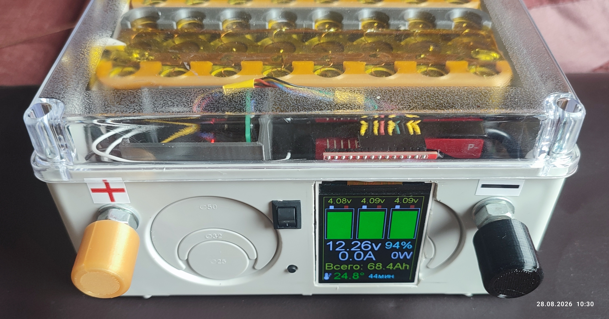

# Li-Ion-Battery-Monitor
# Accu-Li-Ion: DIY‑монитор Li‑Ion АКБ на ESPHome
 

    
    
    
    

## 🌟 Описание Проекта

Это мой проект для контроля литий‑ионной батареи: всё, что нужно знать о состоянии аккумулятора — на одном TFT‑экране. Проект сделан на ESP32‑C3 и ESPHome, чтобы легко интегрировать в Home Assistant.

## Что умеет система

- Показывает **напряжение по ячейкам** и общее напряжение.
- Измеряет **ток, мощность, накопленную энергию** (Wh и Ah).
- Следит за **температурой** аккумулятора.
- Рисует **наглядные графики** для каждой ячейки, добавляет иконки и цветовые подсказки.
- Считает **накопленную ёмкость** (Ah) и сохраняет значение между перезагрузками.
- Позволяет **сбросить счётчик** или установить «полный бак» одной кнопкой.

## Как это работает

- **INA3221** снимает напряжение на трёх ячейках; программно компенсируются падения на соединениях.
- **INA226** измеряет ток с высокой точностью; применена калибровка по реальным замерам клещами.
- **DS18B20** даёт температуру; данные обновляются каждые 5 секунд.
- **Дисплей ST7789V** выводит всю информацию в удобном виде: крупные цифры, шкалы, иконки, цветовые зоны.
- Уровень заряда рассчитывается по напряжению с помощью таблицы точек (`calibrate_linear`).

## Почему это удобно

- Всё в одном YAML‑файле с модульной структурой (подключения вынесены в отдельные файлы).
- Легко адаптировать под другую ёмкость или другую батарею.
- Готовая интеграция с Home Assistant (API, OTA, веб‑интерфейс).

## Что понадобится

- Плата на базе ESP32‑C3.
- Дисплей ST7789V.
- Датчики INA3221, INA226.
- Датчик температуры DS18B20.
- Провода, разъёмы, корпус (по желанию).

## 📊 Скриншоты и Видео

- [yaml файл прошивки](accu_monitor.yaml)
- [внешний вид](images/accu_monitor.jpg)
- [Схема соединений](images/shema_accu_monitor.jpg)
- [Видео YOUTUBE](https://youtu.be/gehCZNr6iQs)
- [Видео RUTUBE](https://rutube.ru/video/cc3a3956d8b0eb6a3adb3e8a28c60828/)

## 📄 Лицензия

Этот проект распространяется под лицензией MIT. Используйте на свой страх и риск.

##  Дополнительные источники информации

Телеграм канал https://t.me/parus_smart
Макс канал https://max.ru/channel_parus_smart

## 🙏 Благодарности

- ESPHome сообществу за отличный фреймворк.
- Home Assistant за интеграцию.
- Вам за использование! Если проект полезен, поставьте ⭐ на GitHub.

*Создано с ❤️ ParusSmartHome. Версия: 25.07.2026*
